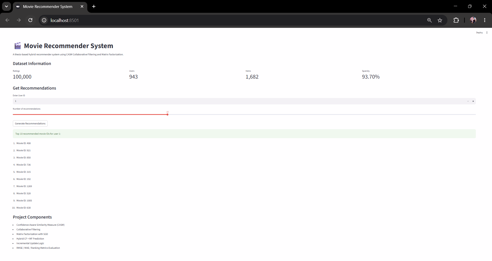

# Movie Recommender System

A thesis-based movie recommendation system built with Collaborative Filtering, Confidence-Aware Similarity Measure, Matrix Factorization, Hybrid Prediction, Incremental Update Logic, and Streamlit demo.

This project is based on the concepts developed in my MSc thesis on incremental collaborative filtering recommender systems.

---

## Project Overview

Recommender systems help users discover relevant items by learning from historical user-item interactions.

This project implements a movie recommendation system using the MovieLens dataset and combines multiple recommendation techniques:

- User-based Collaborative Filtering
- Confidence-Aware Similarity Measure
- Matrix Factorization with SGD
- Hybrid CF + MF prediction
- Incremental update logic
- Rating prediction evaluation
- Ranking recommendation evaluation
- Streamlit demo application

The project focuses on both recommendation accuracy and scalability concepts.

---

## Why This Project Matters

Traditional collaborative filtering methods suffer from several limitations:

- Data sparsity
- Cold-start problems
- Scalability issues
- Expensive similarity recomputation
- Unreliable similarity values when users share few common ratings
- Difficulty adapting to new user-item interactions

This project addresses these problems by combining confidence-aware similarity weighting, matrix factorization, and incremental update logic.

---

## Key Contributions

### 1. Confidence-Aware Similarity Measure

The project uses a confidence-aware similarity approach inspired by the thesis methodology.

Instead of relying only on raw Pearson similarity, similarity is adjusted using multiple confidence factors:

- Pearson correlation core
- Common-rating support
- Jaccard overlap
- User expertise / rating activity

This helps reduce unreliable similarity scores when users have very few co-rated items.

Conceptually:

```text
Final Similarity = Pearson Similarity × Support Confidence × Jaccard Confidence × Expertise Weight
```

---

### 2. Collaborative Filtering

The project applies user-based collaborative filtering to identify similar users and generate recommendations based on neighbor preferences.

General workflow:

```text
User-item ratings
   ↓
User similarity calculation
   ↓
Top similar users
   ↓
Weighted rating prediction
   ↓
Recommendation list
```

---

### 3. Matrix Factorization

Matrix Factorization is used to learn latent user and item representations.

The project uses SGD-based optimization to estimate hidden factors behind user preferences and item characteristics.

General idea:

```text
Rating ≈ User latent vector × Item latent vector
```

Matrix Factorization helps improve predictions in sparse rating matrices.

---

### 4. Hybrid Prediction

The recommender combines Collaborative Filtering and Matrix Factorization predictions.

Hybrid recommendation systems can be more robust because they combine neighborhood-based information with latent factor modeling.

Conceptually:

```text
Final Prediction = α × CF Prediction + (1 - α) × MF Prediction
```

---

### 5. Incremental Update Logic

Traditional collaborative filtering can require expensive full similarity recomputation when new ratings arrive.

This project includes incremental update logic to update affected similarity relationships instead of recomputing the entire similarity matrix.

Conceptually:

```text
New rating arrives
   ↓
Identify affected user/item relationships
   ↓
Update relevant similarities
   ↓
Refresh recommendations
```

This reflects the scalability motivation behind the thesis work.

---

## Dataset

The project uses the MovieLens dataset.

The demo version is based on MovieLens-style ratings data with:

| Metric | Value |
|---|---:|
| Ratings | 100,000 |
| Users | 943 |
| Items | 1,682 |
| Sparsity | 93.70% |

The raw dataset is excluded from GitHub using `.gitignore`.

Expected raw data location:

```text
data/raw/
```

---

## Project Structure

```text
movie-recommender-system/
│
├── app/
│   └── streamlit_app.py
│
├── data/
│   ├── raw/
│   └── processed/
│
├── notebooks/
│
├── results/
│   ├── figures/
│   │   ├── rating_metrics.png
│   │   └── ranking_metrics_at_10.png
│   │
│   └── metrics.csv
│
├── screenshots/
│   └── recommender_app_overview.png
│
├── src/
│   ├── __init__.py
│   ├── config.py
│   ├── data_loader.py
│   ├── prepare_datasets.py
│   ├── preprocessing.py
│   ├── similarity.py
│   ├── recommender.py
│   ├── matrix_factorization.py
│   ├── evaluation.py
│   ├── visualization.py
│   └── utils.py
│
├── .gitignore
├── main.py
├── README.md
└── requirements.txt
```

---

## App Preview

The Streamlit demo allows users to enter a user ID and generate movie recommendations.



---

## Methodology

### 1. Data Loading

MovieLens rating data is loaded from the raw data directory.

The data includes user IDs, item IDs, ratings, and timestamps.

---

### 2. Preprocessing

The preprocessing stage prepares the user-item rating matrix.

Main steps include:

- Loading raw ratings
- Cleaning and formatting columns
- Creating user-item interaction matrix
- Handling sparse user-item data
- Preparing train/test splits

---

### 3. Confidence-Aware Similarity

The system calculates user similarity using a confidence-aware approach.

The similarity module considers:

```text
Pearson similarity
Common item support
Jaccard overlap
User rating activity
```

This improves the reliability of similarity values in sparse recommender system settings.

---

### 4. Collaborative Filtering Prediction

The Collaborative Filtering component predicts ratings based on similar users.

General prediction logic:

```text
Target user
   ↓
Find similar users
   ↓
Select neighbors who rated the item
   ↓
Compute weighted rating prediction
```

---

### 5. Matrix Factorization

The Matrix Factorization component learns latent factors for users and items using SGD.

It helps capture hidden patterns that may not be visible through neighborhood-based similarity alone.

---

### 6. Hybrid Recommendation

The hybrid recommender combines:

```text
Collaborative Filtering prediction
Matrix Factorization prediction
```

This provides more stable predictions than using either method alone.

---

### 7. Incremental Update Concept

The project includes incremental update logic inspired by the thesis contribution.

Instead of recomputing all similarities after every new rating, the incremental approach updates only affected similarity relationships.

This helps address scalability challenges in dynamic recommender systems.

---

## Evaluation

The project evaluates recommendation performance using both rating prediction metrics and ranking metrics.

### Rating Prediction Metrics

- RMSE
- MAE

### Ranking Metrics

- Precision@K
- Recall@K
- F1@K
- NDCG@K
- MRR@K

Evaluation outputs are saved in:

```text
results/metrics.csv
```

Visualization outputs:

```text
results/figures/rating_metrics.png
results/figures/ranking_metrics_at_10.png
```

---

## Result Visualizations

### Rating Metrics


### Ranking Metrics at 10


---

## Streamlit Demo

Run the Streamlit app:

```bash
streamlit run app/streamlit_app.py
```

The app shows:

- Dataset information
- Number of ratings
- Number of users
- Number of items
- Sparsity level
- User ID input
- Number of recommendations selector
- Generated movie recommendation list
- Project components

---

## How to Run

### 1. Clone the repository

```bash
git clone https://github.com/Zahra-ziaee/movie-recommender-system.git
cd movie-recommender-system
```

### 2. Create and activate virtual environment

Windows PowerShell:

```bash
python -m venv .venv
.venv\Scripts\Activate.ps1
```

### 3. Install dependencies

```bash
pip install -r requirements.txt
```

### 4. Add dataset

Place the MovieLens raw data files in:

```text
data/raw/
```

### 5. Run the full pipeline

```bash
python main.py
```

### 6. Run the Streamlit app

```bash
streamlit run app/streamlit_app.py
```

---

## Outputs

Running the project generates:

```text
results/metrics.csv
results/figures/rating_metrics.png
results/figures/ranking_metrics_at_10.png
```

---

## Business / Research Insights

- Confidence-aware similarity helps reduce unreliable neighbor relationships in sparse rating data.
- Matrix Factorization captures latent user-item preference patterns.
- Hybrid CF + MF prediction improves robustness compared with a single recommendation method.
- Incremental update logic supports scalability in dynamic recommender systems.
- Ranking metrics provide a more realistic view of recommendation quality than rating metrics alone.

---

## Current Status

Completed:

- MovieLens data loading
- Rating matrix creation
- Confidence-aware similarity calculation
- Collaborative Filtering recommender
- Matrix Factorization model
- Hybrid prediction logic
- Incremental update concept
- Rating prediction evaluation
- Ranking metrics evaluation
- Result visualization
- Streamlit demo
- App screenshot in README
- GitHub-ready structure

Planned next steps:

- Add movie title metadata to recommendations
- Add item-based collaborative filtering
- Add larger MovieLens dataset support
- Add more detailed incremental update benchmarking
- Add API endpoint for recommendations
- Add Docker support
- Add automated tests
- Add GitHub Actions workflow

---

## Technologies Used

- Python
- Pandas
- NumPy
- Scikit-learn
- Streamlit
- Matplotlib
- Collaborative Filtering
- Matrix Factorization
- Recommender Systems
- Git
- GitHub

---

## Key Takeaways

```text
Movie Recommender System | Python, Collaborative Filtering, Matrix Factorization, Streamlit

- Built a thesis-based movie recommender system using confidence-aware collaborative filtering, matrix factorization, hybrid prediction, and incremental update logic.
- Implemented user similarity calculation with confidence weighting to improve reliability in sparse rating data.
- Combined neighborhood-based collaborative filtering with matrix factorization for more robust rating prediction and recommendation generation.
- Evaluated the system using RMSE, MAE, Precision@K, Recall@K, F1@K, NDCG@K, and MRR@K.
- Built a Streamlit demo to generate top-N movie recommendations for selected users.
```

---

## Author

Zahra Ziaee

MSc Computer Science - Data Mining  
Thesis Focus: Incremental Collaborative Filtering, Confidence-Aware Similarity, Hybrid Recommendation Systems, and Scalable Recommender Systems
