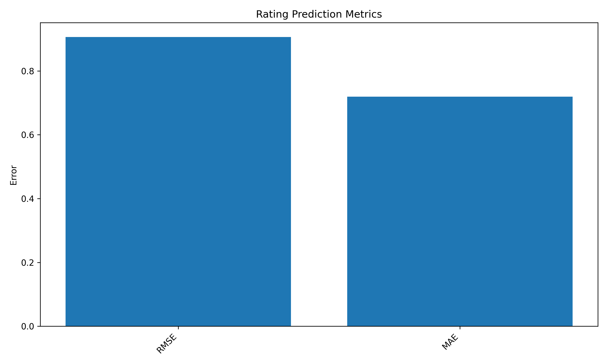
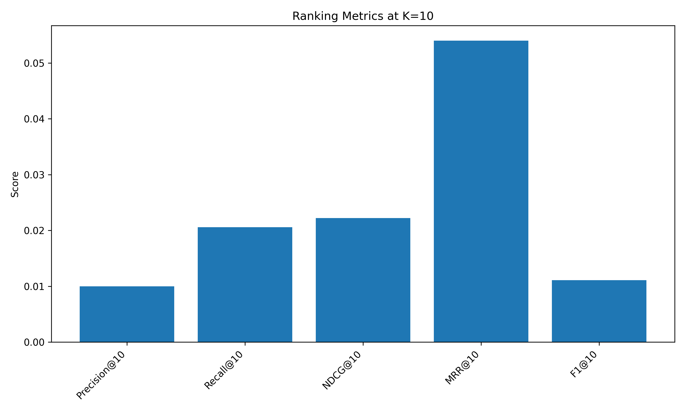

# Scalable Movie Recommendation System with CASM

A thesis-based recommender system project built with Python, focusing on scalable collaborative filtering, confidence-aware similarity, incremental updates, and recommender-system evaluation.

This project is based on my MSc thesis on scalable recommender systems using incremental collaborative filtering. The goal is to transform the academic implementation into a clean, modular, GitHub-ready data science project.

---

## Project Overview

Recommender systems are widely used in digital platforms to reduce information overload and personalize user experience. Traditional collaborative filtering methods, however, face challenges when the data is large, sparse, and dynamic.

This project implements a recommender system based on:

- Collaborative Filtering
- Confidence-Aware Similarity Measure (CASM)
- Baseline bias prediction
- Incremental cache invalidation
- Rating prediction evaluation
- Ranking quality evaluation

The current version runs on the MovieLens 100K dataset and is designed to be extended to MovieLens 1M and MovieLens 10M.

---

## Main Features

- Loads and preprocesses MovieLens datasets
- Supports modular project structure
- Implements CASM similarity
- Uses user-item rating dictionaries for efficient access
- Predicts user-item ratings
- Generates Top-N recommendations
- Evaluates rating prediction using RMSE and MAE
- Evaluates ranking quality using Precision@K, Recall@K, NDCG@K, MRR@K, and F1@K
- Keeps raw and processed datasets out of GitHub using `.gitignore`

---

## Project Structure

```text
movie-recommender-system/
│
├── app/
│   └── streamlit_app.py
│
├── data/
│   ├── raw/
│   │   ├── ml-100k/
│   │   ├── ml-1m/
│   │   └── ml-10m/
│   │
│   └── processed/
│
├── notebooks/
│
├── results/
│   └── figures/
│
├── src/
│   ├── config.py
│   ├── data_loader.py
│   ├── evaluation.py
│   ├── matrix_factorization.py
│   ├── prepare_datasets.py
│   ├── preprocessing.py
│   ├── recommender.py
│   ├── similarity.py
│   └── utils.py
│
├── .gitignore
├── main.py
├── README.md
└── requirements.txt
```

---

## Dataset

This project uses the MovieLens datasets published by GroupLens.

Supported datasets:

- MovieLens 100K
- MovieLens 1M
- MovieLens 10M

The datasets are not included in this repository because they are stored locally and excluded using `.gitignore`.

Download the datasets from the official GroupLens website:

```text
https://grouplens.org/datasets/movielens/
```

After downloading and extracting them, place the files as follows:

```text
data/raw/ml-100k/u.data
data/raw/ml-1m/ratings.dat
data/raw/ml-10m/ratings.dat
```

Then prepare the dataset:

```bash
python src/prepare_datasets.py
```

The current default setup prepares MovieLens 100K. MovieLens 1M and 10M support will be added in later experiments.

This creates a processed CSV file such as:

```text
data/processed/ratings_100k.csv
```

---

## Methodology

### 1. Collaborative Filtering

The recommender uses user-item interactions to estimate user preferences. Similar users are identified based on shared rated items.

### 2. CASM Similarity

The Confidence-Aware Similarity Measure combines several components:

- Pearson correlation
- Support confidence
- Jaccard overlap
- User expertise weight

This reduces the impact of unreliable similarities in sparse data.

### 3. Baseline Bias Prediction

The model uses a baseline prediction based on:

- Global average rating
- User bias
- Item bias

The final rating prediction combines baseline estimation with collaborative filtering output.

### 4. Incremental Update Logic

The project includes an incremental update mechanism. When a new rating is added, only the affected user-item structures and related similarity cache entries are updated.

---

## Evaluation Metrics

### Rating Prediction Metrics

- RMSE
- MAE

### Ranking Metrics

- Precision@K
- Recall@K
- NDCG@K
- MRR@K
- F1@K

---

## Current Results on MovieLens 100K

The current hybrid implementation was tested on the MovieLens 100K dataset.

Dataset statistics:

| Metric | Value |
|---|---:|
| Total ratings | 100,000 |
| Total users | 943 |
| Total items | 1,682 |
| Sparsity | 93.69% |
| Train size | 80,000 |
| Test size | 20,000 |

Rating prediction results:

| Metric | Value |
|---|---:|
| RMSE | 0.9061 |
| MAE | 0.7195 |
| Sample size | 1,000 |

Ranking evaluation results:

| Metric | Value |
|---|---:|
| Precision@5 | 0.0440 |
| Recall@5 | 0.0136 |
| NDCG@5 | 0.0557 |
| MRR@5 | 0.1407 |
| F1@5 | 0.0188 |
| Precision@10 | 0.0340 |
| Recall@10 | 0.0238 |
| NDCG@10 | 0.0481 |
| MRR@10 | 0.1560 |
| F1@10 | 0.0242 |
| Precision@20 | 0.0330 |
| Recall@20 | 0.0472 |
| NDCG@20 | 0.0535 |
| MRR@20 | 0.1613 |
| F1@20 | 0.0336 |

The hybrid model improved rating prediction compared with the earlier CASM-only version. The system now combines confidence-aware collaborative filtering, baseline bias prediction, matrix factorization, and incremental update logic.

### Result Visualizations

Rating prediction metrics:



Ranking metrics at K=10:



Note: Ranking evaluation is currently performed using sampled candidate items for faster execution.

## How to Run

## Streamlit Demo

Run the interactive recommendation demo:

```bash
streamlit run app/streamlit_app.py

The demo allows users to enter a user ID and generate Top-N movie recommendations using the hybrid CASM-CF and Matrix Factorization recommender.

### 1. Clone the repository

```bash
git clone https://github.com/Zahra-ziaee/movie-recommender-system.git
cd movie-recommender-system
```

### 2. Create and activate a virtual environment

Windows PowerShell:

```bash
python -m venv .venv
.venv\Scripts\Activate.ps1
```

### 3. Install dependencies

```bash
pip install -r requirements.txt
```

### 4. Prepare the dataset

Make sure the MovieLens files are placed in the correct folders, then run:

```bash
python src/prepare_datasets.py
```

### 5. Run the project

```bash
python main.py
```

---

## Current Status

Completed:

- Project structure
- GitHub setup
- MovieLens 100K data preparation
- Data loading and train/test split
- CASM similarity engine
- Rating prediction
- RMSE and MAE evaluation
- Top-N recommendation generation
- Ranking metrics evaluation

Planned next steps:

- Add Matrix Factorization with SGD
- Add Hybrid CF + MF prediction
- Add full MovieLens 1M and 10M experiments
- Add result visualizations
- Add Streamlit demo
- Add experiment configuration and logging

---

## Technologies Used

- Python
- NumPy
- Pandas
- Scikit-learn
- Git
- GitHub

---

## Author

Zahra Ziaee

MSc Computer Science - Data Mining  
Focus: Recommender Systems, Collaborative Filtering, Incremental Learning, and Scalable Machine Learning